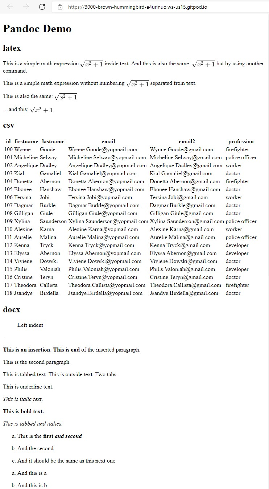

# Astro Pandoc 

Astro component for using pandoc to convert content. This allows you to embed any format pandoc supports. 
- Supported formats https://pandoc.org/MANUAL.html#general-options
- [Demo](https://github.com/trashhalo/astro-pandoc/blob/main/src/components/Demo.astro)
- Requires you to have pandoc installed on your machine!

## Usage
```astro
---
import Pandoc from "astro-pandoc";
---
<Pandoc caller={import.meta.url} file="Component.tex" extraArgs={["--webtex"]} /
```

Component.tex
```latex
\documentclass{article}
\usepackage{amsmath} % for the equation* environment
\begin{document}

This is a simple math expression \(\sqrt{x^2+1}\) inside text. 
And this is also the same: 
\begin{math}
\sqrt{x^2+1}
\end{math}
but by using another command.

This is a simple math expression without numbering
\[\sqrt{x^2+1}\] 
separated from text.

This is also the same:
\begin{displaymath}
\sqrt{x^2+1}
\end{displaymath}

\ldots and this:
\begin{equation*}
\sqrt{x^2+1}
\end{equation*}

\end{document}
```



## Props
* caller: url of the caller so we can use it to look up relative paths
* file: input file relative to the caller
* extraArgs: optional. array of extra arguments to pass to pandoc
* template: optional. control the html generated by pandoc